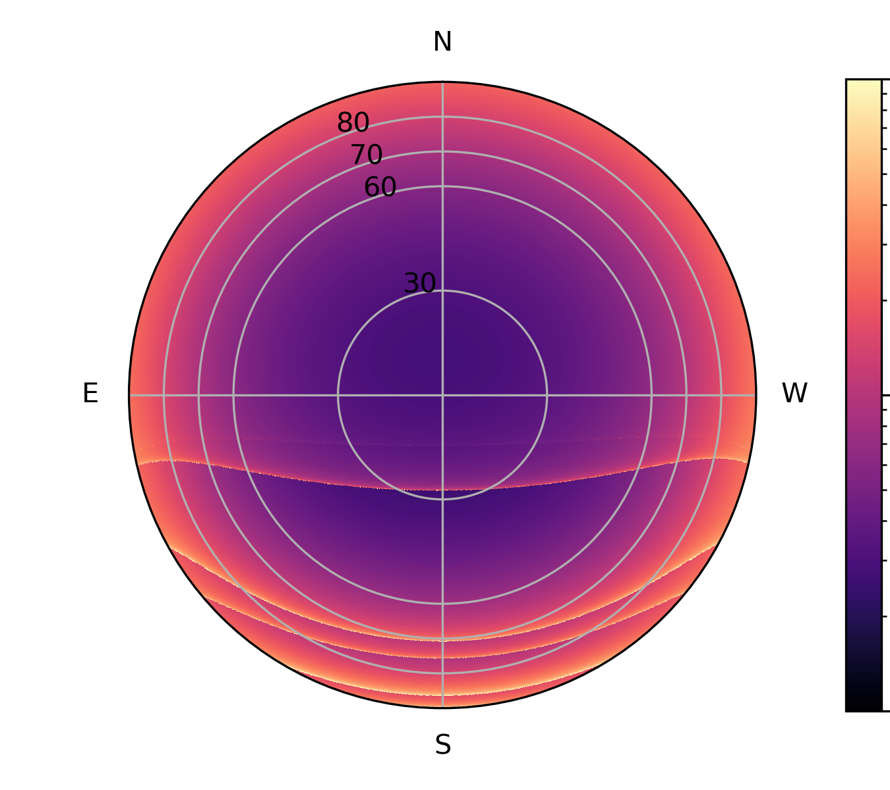

# Analytical-Satsky

[](https://github.com/nicolas-cerardi/Analytical-Satsky/actions/workflows/tests.yml)
[](https://github.com/nicolas-cerardi/Analytical-Satsky/blob/main/LICENSE)
[](https://arxiv.org/abs/2604.22694)

Modelling satellite constellations seen from astronomical observatories

<p align="center">
  
</p>

## Overview

The number of artificial satellites in low earth orbit is increasing very fast, due to the deployment of large communication constellations, comprising from hundreds to tens of thousands of satellites.
This already has in impact on astronomical observations, as optical and radio telescopes respectively see more frequent trails and radio frequency interferences left by these satellites. Still, this is only a glimpse of what will happen in the next decade, when the number of satellites could be multiplied by ten.

Predicting the impact on science from these satellites is a difficult task, and requires to simulate the trajectories of up to 100,000 satellite. Instead of this discrete description of each individual satellite, this package implements an analytical model for predicting the number of satellites, as presented in [Bassa et al. 2022](https://www.aanda.org/articles/aa/abs/2022/01/aa42101-21/aa42101-21.html). It is here adapted to radio telescopes, providing dedicated features.

## Features

- Load predefined satellite shell tables from the major upcoming constellations
- Compute sky maps of the instantaneous satellite density, from a specific observatory
- Predict the number of satellites entering the field of view for a given observation

## Installation

Simply git clone and pip install locally

```bash
git clone https://github.com/nicolas-cerardi/Analytical-Satsky.git
cd Analytical-Satsky 
pip install -e .
```

## Quick start

A minimal working code:

```python
import numpy as np
import astropy.units as u
from astropy.coordinates import EarthLocation
from analytical_satsky import compute_total_satellite_density, load_constellation

shells_df = load_constellation("starlink_filing2")
obsloc = EarthLocation.of_site("SKA-Low")

n_satellite_in_obs = compute_total_satellite_density(
    obsloc,                    # Observer
    shells_df,                 # Satellites shells
    np.array([-31.])*u.deg,    # DEC of pointing
    np.array([110.])*u.deg,    # RA of pointing
    10.*u.deg,                 # Effective beam width
    3600*u.s                   # exposure time
)

print(n_satellite_in_obs)
```

For more, see the demo notebooks:

- Compute a full sky map of number of satellite per hour of observation: [notebooks/satellite_density_maps.ipynb](https://github.com/nicolas-cerardi/Analytical-Satsky/blob/main/notebooks/satellite_density_maps.ipynb)
- Compute satellite occupancy, as a function of target declination, with error bars: [notebooks/compute_satellite_occupancy.ipynb](https://github.com/nicolas-cerardi/Analytical-Satsky/blob/main/notebooks/compute_satellite_occupancy.ipynb)

And the documentation (in progress):

- [API reference](docs/api.md)
- [Constellations](docs/constellations.md)

## Repository structure

- `analytical_satsky/` — Python package containing the analytical model and utilities  
- `notebooks/` — Tutorials and figure reproduction examples  
- `tests/` — Unit and smoke tests executed automatically
- `docs/` — Documentation  

## Roadmap

- In development: sampling realistic satellite trajectories and computing an integral model.

## Citation

If you reuse this code in an academic work, please cite the accompanying paper:

- Cerardi, N. Tolley, E. and di Vruno, F., Forecasting the occupancy of satellite megaconstellations in SKA observations, Letter to the Editor, accepted in Astronomy and Astrophysics, 2026

```bibtex
@article{Cerardi_2026,
   title={Forecasting the occupancy of satellite megaconstellations in SKA observations},
   ISSN={1432-0746},
   url={http://dx.doi.org/10.1051/0004-6361/202558309},
   DOI={10.1051/0004-6361/202558309},
   journal={Astronomy &amp; Astrophysics},
   publisher={EDP Sciences},
   author={Cerardi, N. and Tolley, E. and di Vruno, F.},
   year={2026},
   month=Apr }
```
